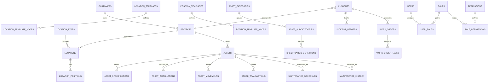

# Database Design - ARIMS / SIRMS

This folder contains the Version 1.0 migration-based PostgreSQL 17 implementation for ARIMS / SIRMS. The schema is organized for immediate FastAPI backend development and future changes should be delivered as additive migrations rather than redesign.

## Execution Order

1. `database/ddl/001_create_extensions.sql`
2. `database/ddl/002_master_tables.sql`
3. `database/ddl/003_security.sql`
4. `database/ddl/004_common.sql`
5. `database/ddl/005_infrastructure.sql`
6. `database/ddl/006_asset.sql`
7. `database/ddl/007_incident.sql`
8. `database/ddl/008_indexes.sql`
9. `database/ddl/009_views.sql`
10. `database/ddl/010_functions.sql`
11. `database/ddl/011_triggers.sql`
12. `database/seed/012_seed_master.sql`
13. `database/seed/013_seed_templates.sql`
14. `database/seed/014_seed_sample.sql`

## Architecture

- `master` stores all lookups, lifecycle values, movement types, dynamic specification definitions, and reusable location or position templates.
- `security` stores users, roles, permissions, role grants, login history, password reset tokens, refresh tokens, and API tokens.
- `common` stores customers, projects, vendors, attachments, numbering, notifications, import and export logs, comments, tags, favorites, and shared preferences.
- `infrastructure` stores unlimited-depth locations and installation positions, with support for template-driven creation and GIS-ready attributes.
- `asset` stores the asset register, dynamic specifications, stock transactions, movements, installations, documents, photos, relationships, and maintenance history.
- `incident` stores incidents, timeline updates, work orders, and incident attachments.

## Naming Conventions

- Schemas map directly to modules: `master`, `security`, `common`, `infrastructure`, `asset`, `incident`.
- Master tables use `BIGSERIAL` keys; transactional and history tables use `UUID`.
- Codes are uppercase snake style values such as `POWER_STATION`, while business numbers such as `INC000153` are stored as formatted strings.
- All tables use the standard audit columns `created_at`, `created_by`, `updated_at`, `updated_by`, and `is_active`.

## Index Strategy

- Foreign keys are indexed in `database/ddl/008_indexes.sql`.
- High-traffic search columns such as asset number, incident number, work order number, parent location, status, and due dates are indexed.
- Generic search helpers such as comments and entity tags use composite indexes on `entity_name` and `entity_id`.

## Schema Overview

- `master` contains lookup and template metadata only.
- `security` contains user identity, access control, and token storage.
- `common` contains cross-module reference and utility tables.
- `infrastructure` contains hierarchical site structure and position capacity.
- `asset` contains operational asset, stock, and maintenance history.
- `incident` contains service and incident tracking history.

## Column Descriptions

- Business identifiers use `*_number` or `*_code` consistently.
- Foreign keys use `<entity>_id` consistently across schemas.
- JSON payloads are used only where flexible user-defined or reporting/filtering metadata is required.
- Current-state pointers such as `asset.assets.current_location_id` are performance helpers and are synchronized from historical tables.

## Template System

- `master.location_templates` and `master.location_template_nodes` define reusable location structures.
- `master.position_templates` and `master.position_template_nodes` define reusable position structures.
- `infrastructure.create_location_from_template()` creates a root location from a template.
- `infrastructure.create_positions_from_template()` can populate `infrastructure.location_positions` directly from a template.
- The seed data includes pole, power station, building, watch tower, gate, and store location templates.
- The seed data also includes reusable pole, power station, watch tower, gate, and store position templates.

## Asset Lifecycle

- `master.asset_lifecycle` defines lifecycle stages such as procured, commissioned, in service, repair, and retired.
- `asset.assets` stores the current lifecycle stage and current location, while `asset.asset_installations` preserves historical installation records.
- `asset.asset_movements` and `asset.stock_transactions` together provide permanent traceability for field and stock changes.

## Incident Lifecycle

- `incident.incidents` stores the current state.
- `incident.incident_updates` preserves the incident timeline.
- `incident.work_orders` and `incident.work_order_tasks` support downstream corrective action.
- `common.watch_list`, `common.comments`, and `common.notifications` support operational collaboration around incidents.

## Maintenance Workflow

- `asset.maintenance_checklists` and `asset.checklist_items` define reusable maintenance procedures.
- `asset.maintenance_schedules` holds future due work and responsibility.
- `asset.maintenance_history` stores append-only execution history with optional vendor, failure, and root cause data.

## Location Hierarchy Example

- `Project -> Building -> Floor -> Room`
- `Project -> Power Station`
- `Project -> Pole`
- `Project -> Gate`
- `Project -> Store`

## Migration Strategy

- Version 1.0 is frozen at the migration set above.
- Future changes should use new numbered migration files such as `015_add_x.sql`.
- Existing Version 1.0 objects should not be redesigned in place unless a production defect requires it.

## Developer Notes

- `common.number_sequences` supports configurable numbering for assets, locations, incidents, and work orders.
- `asset.asset_specifications` uses typed value columns and `master.specification_definitions` to avoid schema churn for new attributes.
- Cross-schema foreign keys that depend on migration order are added in later scripts where needed.
- Validation is provided in `database/validation/001_verify_database.sql`.

## Validation

- Execute all DDL and seed scripts in order, then run `database/validation/001_verify_database.sql`.
- The validation script checks schema presence, table presence, required views, helper functions, triggers, and sample seed behavior.
- The validation script also confirms that numbering, location path lookup, current asset location lookup, and sample records are working.

## Deployment Scripts

- `database/deploy.sql` deploys Version 1.0 into a clean database and refuses to run if ARIMS / SIRMS objects already exist.
- `database/reset.sql` drops only the ARIMS / SIRMS application schemas from the current database.
- `database/redeploy.sql` runs `database/reset.sql` and then `database/deploy.sql` for a one-command local rebuild.

## ER Diagram

